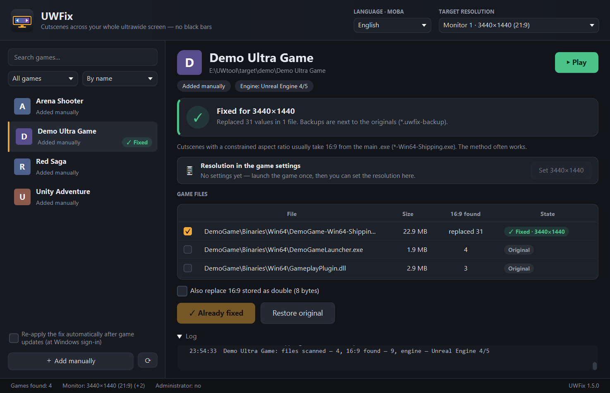
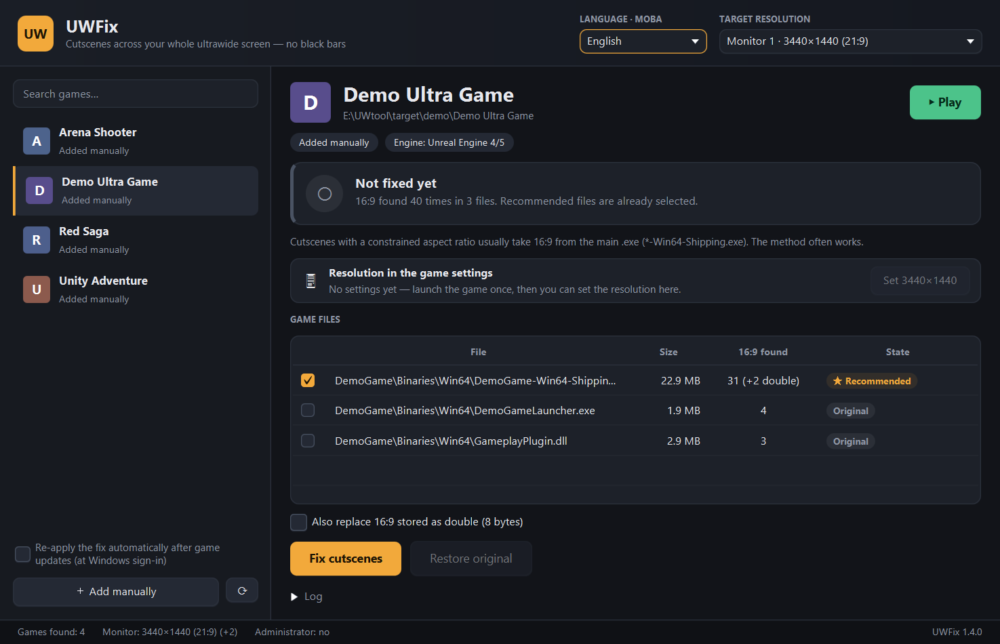
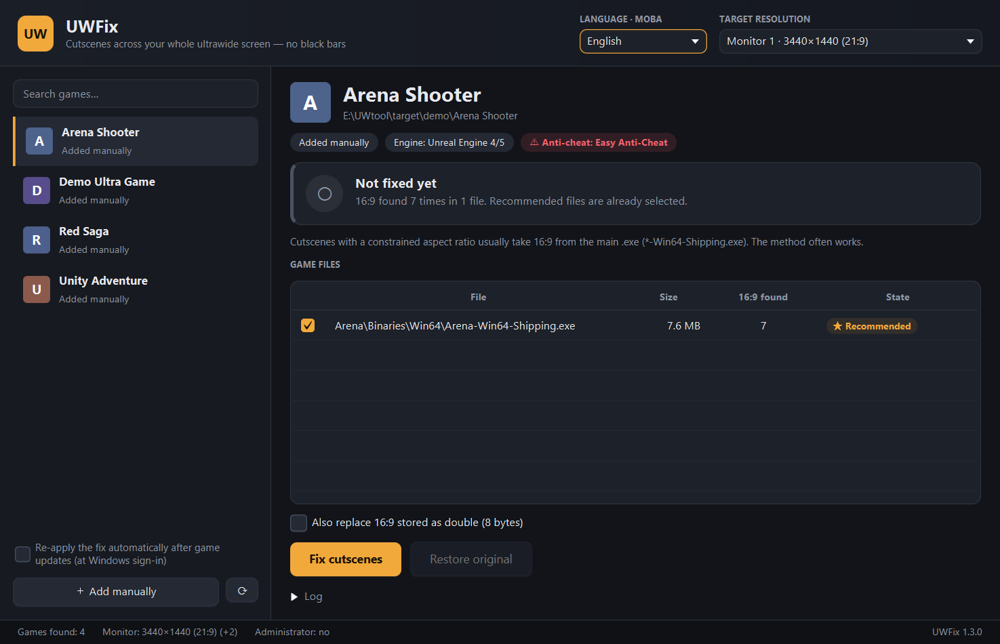
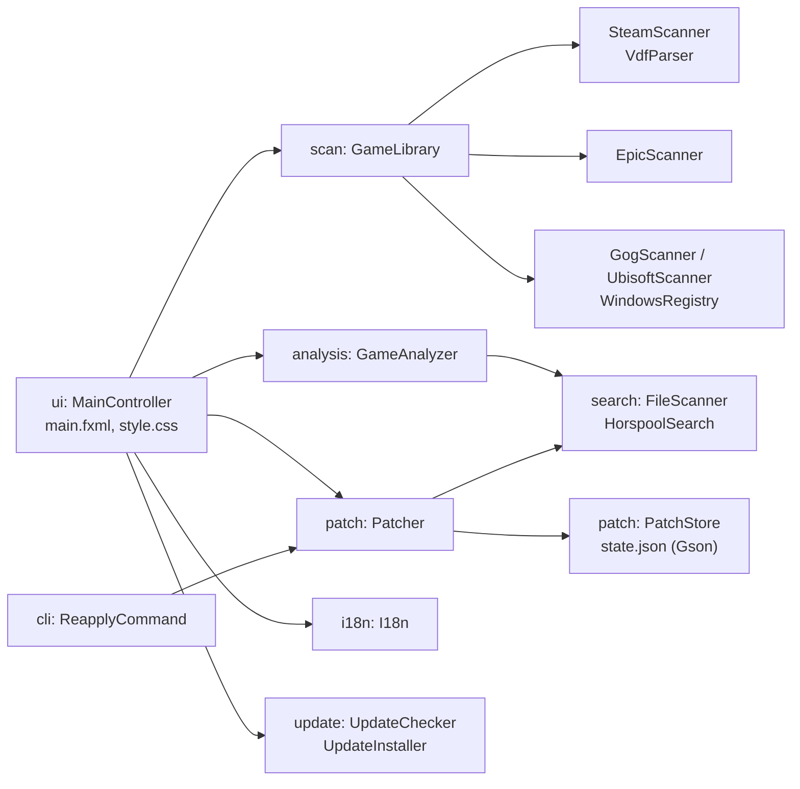

# UWFix — ultrawide cutscenes without black bars

**English** · [Українська](README.uk.md)

UWFix finds your installed games (Steam, Epic Games, GOG, Ubisoft Connect) and removes the black bars
on the sides of cutscenes on 21:9 and 32:9 monitors — with one button.



**[⬇ Download the latest release](https://github.com/shkbb/UWFix/releases/latest)** — an installer or a portable version. Java is bundled, nothing else to install. Windows 10/11 x64.

## How it works

Most games store the cutscene aspect ratio as a floating-point number 16 / 9 = 1.7777778.
In the executable it is written in IEEE 754 format (float, 4 bytes, little-endian):

| Resolution          | Ratio | Bytes in the file |
|---------------------|-------|-------------------|
| 1920×1080 (16:9)    | 1.778 | `39 8E E3 3F`     |
| 2560×1080 (21:9)    | 2.370 | `26 B4 17 40`     |
| 3440×1440 (21:9)    | 2.389 | `8E E3 18 40`     |
| 3840×1600 (24:10)   | 2.400 | `9A 99 19 40`     |
| 5120×1440 (32:9)    | 3.556 | `39 8E 63 40`     |

Replace `39 8E E3 3F` with your monitor's value and the game believes the cutscenes were made for your
screen, so it stops adding bars. The community does this by hand in a hex editor
(e.g. [UltraAspect](https://github.com/coralian/UltraAspect) for The Witcher 3).
UWFix does it automatically and safely. **Any resolution works** — the value is computed as width ÷ height,
not taken from a fixed table.

## Features

- **Game discovery**: Steam (all libraries on all drives), Epic Games, GOG, Ubisoft Connect, plus any folder added manually.
- **Game icons and cover art**: Steam games get their icon, background art and logo from Steam's local cache, other games — an icon straight from the game's .exe (the app parses the Windows PE resource table itself).
- **Search, filters and sorting**: search ignores case and punctuation; show all / fixed / not fixed / updated games; sort by name (Ukrainian alphabet aware), launcher or fixed first.
- **Monitor detection**: every connected monitor is detected automatically, taking Windows scaling into account; you can pick another resolution or enter your own.
- **Game analysis**: finds .exe and .dll files containing 16:9, skips third-party libraries (Steam API, DirectX, PhysX…), detects the engine (15 engines — see the table below) and suggests which files to patch.
- **Safe patching**:
  - a backup `*.uwfix-backup` is created before any change;
  - only the 4 (or 8) bytes found are changed, the rest of the file is not rewritten;
  - before each write the expected bytes are verified;
  - SHA-256 checksums of the original and the result are stored.
- **Resolution unlock**: for games that don't offer 3440×1440 in their menu, UWFix writes it straight into the game settings — `GameUserSettings.ini` (Unreal Engine 4/5), `*Engine.ini` (Unreal Engine 3, e.g. Life is Strange), the registry (Unity), `video.txt` (Source) or `*Prefs.ini` (Skyrim, Fallout).
- **Play button**: launches the game via Steam / Epic / Ubisoft Connect (achievements and cloud saves keep working) or directly via its .exe.
- **One-click restore** — even without the backup, because UWFix knows every changed location.
- **Update tracking**: when a game updates (Steam replaces the file), UWFix notices the fix is gone and offers to re-apply it. Optionally it can re-apply automatically at Windows sign-in.
- **Anti-cheat warning** (Easy Anti-Cheat, BattlEye, VAC…): modifying online games is risky for your account.
- **Languages**: English and Ukrainian, switchable on the fly.
- **Self-update**: at startup UWFix checks GitHub for a new version; one click downloads it, verifies the SHA-256 checksum and restarts into the new version — no need to download it manually again.

## Supported engines

| Engine | Examples | Detected by | Resolution in game settings |
|--------|----------|-------------|-----------------------------|
| Unreal Engine 4/5 | Silent Hill 2, Stellar Blade, Palworld | `*-Win64-Shipping.exe`, `Content\Paks` | `GameUserSettings.ini` |
| Unreal Engine 3 | Life is Strange, BioShock Infinite | `CookedPC*` | `*Engine.ini` → `[SystemSettings]` |
| Unity | Valheim, Content Warning | `UnityPlayer.dll` | registry (PlayerPrefs) |
| Source | Half-Life 2, Portal 2, Left 4 Dead 2 | `bin\engine.dll` | `cfg\video.txt` or registry |
| Creation Engine / Gamebryo | Skyrim, Fallout 3/4/New Vegas | `Data\*.esm` | `*Prefs.ini` → `iSize W/H` |
| REDengine | The Witcher 3, Cyberpunk 2077 | `bin\x64` + `content` | — |
| RE Engine | Resident Evil 2/3/4/7/Village, Monster Hunter | `re_chunk_000.pak` | — (hint: REFramework) |
| MT Framework | Resident Evil 5/6, Revelations | `nativePC*` | — |
| Source 2 | Counter-Strike 2, Dota 2 | `game\bin\win64\engine2.dll` | — (native 21:9, VAC) |
| RAGE | GTA V, Red Dead Redemption 2 | `*.rpf` | — (native 21:9) |
| CryEngine, Frostbite, GameMaker, Godot | | `CrySystem.dll`, `initfs_Win32`, `data.win`, `*.pck` | — |

For every engine UWFix shows an honest hint: where the 16:9 replacement helps, where the game supports 21:9 by itself and where files are better left alone (online games with anti-cheat).

## Limitations

- The method works only if the game stores 16:9 as a ready-made number. If the ratio is computed differently, UWFix will say “The 16:9 value was not found”.
- **Pre-rendered 16:9 video cutscenes cannot be fixed**: there is no picture on the sides in the video itself.
- In some games the UI may stretch after patching — just press “Restore original”.
- Game settings appear after the first launch — run the game once before setting the resolution in UWFix.
- Microsoft Store / Xbox Game Pass games are write-protected.
- Do not use it for online games with anti-cheat.

## Usage

1. Run `UWFix.exe` (portable) or install it with the installer.
2. Check the target resolution at the top (your monitor by default).
3. Pick a game on the left and wait for the file analysis.
4. Press **Fix cutscenes**.
5. If the game is installed in `Program Files`, UWFix will offer to restart with administrator rights.

App data: `%APPDATA%\UWFix\state.json` (state and settings), `%APPDATA%\UWFix\reapply.log` (automatic check log).

<details>
<summary>More screenshots</summary>

| Game analysis | Anti-cheat warning |
|---|---|
|  |  |

</details>

## Building from source

Only JDK 17 or newer is required. Maven is downloaded automatically (Maven Wrapper).

```bash
mvnw javafx:run
```

```bash
mvnw test
```

```bash
powershell -ExecutionPolicy Bypass -File build-installer.ps1
```

| Command | What it does |
|---------|--------------|
| `mvnw javafx:run` | run during development |
| `mvnw test` | unit tests (JUnit 5) |
| `mvnw test -Pbenchmark` | search algorithm benchmark; result in `target\benchmark-results.txt`; add `-Dbench.file=path\to\game.exe` to use a real file |
| `build-installer.ps1` | portable `dist\UWFix\UWFix.exe`, a `.zip` and the installer `dist\UWFix-<version>.exe` (needs [WiX Toolset 3](https://github.com/wixtoolset/wix3/releases) in `tools\wix`) |
| `make-screenshots.ps1` | documentation screenshots on demo games (real games are not touched) |

## Project structure

```
src/main/java/ua/uwfix/
├── Main.java, App.java       entry point and JavaFX startup
├── model/                    AspectRatio, ValueFormat (IEEE 754), Game, GameSource
├── search/                   search algorithms: NaiveSearch, KmpSearch, HorspoolSearch;
│                             FileScanner — streaming chunked file scan + SHA-256
├── scan/                     game discovery: SteamScanner (VDF parser), EpicScanner (JSON),
│                             GogScanner, UbisoftScanner (registry via reg export), GameLibrary
├── analysis/                 GameAnalyzer (file selection), EngineDetector, AntiCheatDetector
├── settings/                 ResolutionUnlocker, IniEditor, UnityPrefs — resolution in game settings
├── icon/                     PeIconExtractor (icons from .exe: PE resources, PNG/BMP), GameIconLocator (Steam cache)
├── patch/                    Patcher (patch, restore, re-apply), PatchStore (state in JSON)
├── cli/                      ReapplyCommand — silent --reapply mode
├── i18n/                     I18n, Language — translations (messages_en/uk.properties)
├── update/                   UpdateChecker (GitHub Releases API), UpdateInstaller (download, SHA-256, replace)
├── system/                   monitors, administrator rights, autostart, Explorer
└── ui/                       MainController + main.fxml + style.css (MVC), dialogs, cells
```



## Testing

178 unit tests (JUnit 5): ratio-to-bytes conversion, three search algorithms (checked against a reference
on random data), streaming scan with various chunk sizes, VDF / .reg / JSON parsers, file selection for
different engines, the full “patch → game update → re-apply → restore” cycle, a corrupted state file,
translation completeness (same keys and parameters in both languages), version comparison and safe unpacking of updates (including archives with paths escaping the folder), icon extraction from a synthetic PE file (PNG and BMP icons with a transparency mask).

Search algorithms on 128 MB of machine-code-like data (`mvnw test -Pbenchmark`):

| Algorithm | 4-byte pattern | 8 bytes | 16 bytes |
|-----------|---------------:|--------:|---------:|
| Naive search | 1786 MB/s | 1905 MB/s | 736 MB/s |
| Knuth–Morris–Pratt | 1443 MB/s | 1439 MB/s | 1455 MB/s |
| Boyer–Moore–Horspool | 1546 MB/s | 2868 MB/s | 4628 MB/s |

For the short 16:9 pattern (4 bytes) all algorithms are limited by memory bandwidth. With longer patterns
Horspool skips most of the data and becomes the fastest — that is why UWFix uses it.

## Tech stack

Java 17 · JavaFX 21 (FXML + CSS) · Gson · JUnit 5 · Maven · jpackage/jlink · WiX Toolset 3

## License

[MIT](LICENSE). The software is provided “as is”: you modify game files at your own risk.
