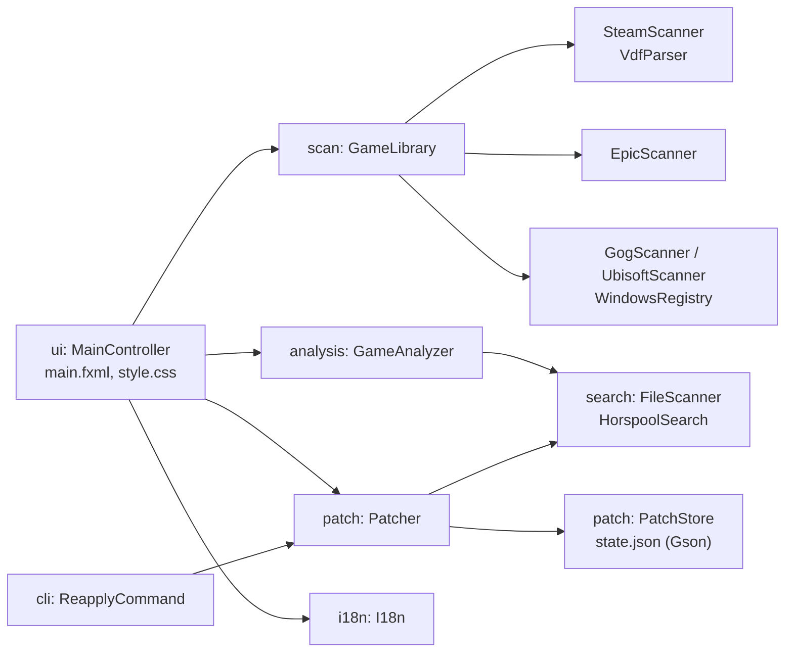

# UWFix — катсцени без чорних смуг на ультрашироких моніторах

[English](README.md) · **Українська**

UWFix знаходить встановлені ігри (Steam, Epic Games, GOG, Ubisoft Connect) і однією кнопкою
прибирає чорні смуги по боках у катсценах на моніторах 21:9 і 32:9.


**[⬇ Завантажити останню версію](https://github.com/shkbb/UWFix/releases/latest)** — інсталятор або портативна версія. Java вбудована, нічого встановлювати не треба. Windows 10/11 x64.

## Як це працює

Більшість ігор зберігає співвідношення сторін катсцен як дробове число 16 / 9 = 1.7777778.
У виконуваному файлі воно записане у форматі IEEE 754 (float, 4 байти, little-endian):

| Роздільна здатність | Співвідношення | Байти у файлі   |
|---------------------|----------------|-----------------|
| 1920×1080 (16:9)    | 1.778          | `39 8E E3 3F`   |
| 2560×1080 (21:9)    | 2.370          | `26 B4 17 40`   |
| 3440×1440 (21:9)    | 2.389          | `8E E3 18 40`   |
| 3840×1600 (24:10)   | 2.400          | `9A 99 19 40`   |
| 5120×1440 (32:9)    | 3.556          | `39 8E 63 40`   |

Якщо замінити `39 8E E3 3F` на значення свого монітора, гра вважатиме, що катсцени зроблені
під твій екран, і перестане додавати смуги. Так спільнота вручну виправляє ігри в hex-редакторі
(наприклад, [UltraAspect](https://github.com/coralian/UltraAspect) для The Witcher 3).
UWFix робить це автоматично й безпечно. **Підходить будь-яка роздільна здатність**: значення
обчислюється як ширина ÷ висота, а не береться з готової таблиці.

## Можливості

- **Пошук ігор**: Steam (усі бібліотеки на всіх дисках), Epic Games, GOG, Ubisoft Connect, а також ручне додавання будь-якої папки.
- **Визначення монітора**: роздільна здатність береться автоматично з урахуванням масштабування Windows; можна обрати іншу або ввести свою.
- **Аналіз гри**: знаходить .exe і .dll з числом 16:9, відкидає сторонні бібліотеки (Steam API, DirectX, PhysX…), визначає рушій (Unreal Engine 3/4/5, Unity, REDengine) і радить, які файли змінювати.
- **Безпечна заміна**:
  - перед зміною створюється резервна копія `*.uwfix-backup`;
  - змінюються лише знайдені 4 (або 8) байтів, решта файлу не переписується;
  - перед кожним записом перевіряється, що на місці саме очікувані байти;
  - контрольна сума SHA-256 оригіналу й результату зберігається в стані програми.
- **Відновлення оригіналу** однією кнопкою — навіть без резервної копії, бо програма знає всі змінені місця.
- **Відстеження оновлень**: після оновлення гри (Steam замінює файл) програма помічає, що фікс злетів, і пропонує застосувати його знову. Можна ввімкнути автоматичне повторне застосування при вході у Windows.
- **Попередження про античит** (Easy Anti-Cheat, BattlEye, VAC тощо): змінювати файли онлайн-ігор небезпечно для акаунта.
- **Мови**: українська та англійська, перемикаються без перезапуску.

## Обмеження

- Метод працює, лише якщо гра зберігає 16:9 як готове число. Якщо співвідношення обчислюється інакше, UWFix покаже «Число 16:9 не знайдено».
- **Відеоролики, записані заздалегідь у 16:9, виправити неможливо**: у самому відео немає зображення по боках.
- Після заміни в окремих іграх інтерфейс може розтягнутися. Тоді натисни «Відновити оригінал».
- UWFix змінює лише співвідношення сторін. Якщо гра не пропонує твою роздільну здатність у налаштуваннях, її треба виставити окремо (зазвичай у файлі конфігурації гри).
- Ігри з Microsoft Store / Xbox Game Pass захищені від змін.
- Не використовуй програму для онлайн-ігор з античитом.

## Використання

1. Запусти `UWFix.exe` (портативна версія) або встанови програму інсталятором.
2. Перевір угорі цільову роздільну здатність (за замовчуванням — твій монітор).
3. Обери гру зліва й дочекайся аналізу файлів.
4. Натисни **«Виправити катсцени»**.
5. Якщо гра встановлена в `Program Files`, програма запропонує перезапуститися з правами адміністратора.

Дані програми: `%APPDATA%\UWFix\state.json` (стан і налаштування), `%APPDATA%\UWFix\reapply.log` (журнал автоперевірок).

<details>
<summary>Більше знімків екрана</summary>

| Аналіз гри | Попередження про античит |
|---|---|
|  |  |

</details>

## Збирання з вихідного коду

Потрібна лише JDK 17 або новіша. Maven завантажиться автоматично (Maven Wrapper).

```bash
mvnw javafx:run
```

```bash
mvnw test
```

```bash
powershell -ExecutionPolicy Bypass -File build-installer.ps1
```

| Команда | Що робить |
|---------|-----------|
| `mvnw javafx:run` | запуск під час розробки |
| `mvnw test` | модульні тести (JUnit 5) |
| `mvnw test -Pbenchmark` | порівняння швидкості алгоритмів пошуку; результат у `target\benchmark-results.txt`; `-Dbench.file=шлях\до\гри.exe` — на справжньому файлі |
| `build-installer.ps1` | портативна версія `dist\UWFix\UWFix.exe`, архів `.zip` та інсталятор `dist\UWFix-<версія>.exe` (потрібен [WiX Toolset 3](https://github.com/wixtoolset/wix3/releases) у `tools\wix`) |
| `make-screenshots.ps1` | знімки екрана для документації на демо-іграх (справжні ігри не змінюються) |

## Структура проєкту

```
src/main/java/ua/uwfix/
├── Main.java, App.java       точка входу і запуск JavaFX
├── model/                    AspectRatio, ValueFormat (IEEE 754), Game, GameSource
├── search/                   алгоритми пошуку: NaiveSearch, KmpSearch, HorspoolSearch;
│                             FileScanner — потокове сканування файлу блоками + SHA-256
├── scan/                     пошук ігор: SteamScanner (парсер VDF), EpicScanner (JSON),
│                             GogScanner, UbisoftScanner (реєстр через reg export), GameLibrary
├── analysis/                 GameAnalyzer (вибір файлів), EngineDetector, AntiCheatDetector
├── patch/                    Patcher (заміна, відновлення, повторне застосування), PatchStore (стан у JSON)
├── cli/                      ReapplyCommand — тихий режим --reapply
├── i18n/                     I18n, Language — переклад (messages_en/uk.properties)
├── system/                   монітори, права адміністратора, автозапуск, Провідник
└── ui/                       MainController + main.fxml + style.css (MVC), діалоги, комірки
```

### Архітектура



- **Модель** — `model`, `search`, `scan`, `analysis`, `patch`: не залежать від інтерфейсу, покриті тестами.
- **Представлення** — `main.fxml` і `style.css`; тексти — у словниках `i18n/messages_*.properties`.
- **Контролер** — `MainController`: обробляє дії користувача, запускає довгі операції у фоновому потоці (`javafx.concurrent.Task`), щоб вікно не зависало.

## Тестування

105 модульних тестів (JUnit 5): перетворення співвідношень у байти, три алгоритми пошуку (порівняння з еталоном на випадкових даних), потокове сканування з різними розмірами блоку, парсери VDF / .reg / JSON, вибір файлів для різних рушіїв, повний цикл «патч → оновлення гри → повторне застосування → відновлення», пошкоджений файл стану, повнота перекладу (однакові ключі й параметри в обох мовах).

Порівняння алгоритмів на 128 МБ даних, схожих на машинний код (`mvnw test -Pbenchmark`):

| Алгоритм | Шаблон 4 байти | 8 байтів | 16 байтів |
|----------|---------------:|---------:|----------:|
| Прямий перебір | 1786 МБ/с | 1905 МБ/с | 736 МБ/с |
| Кнута–Морріса–Пратта | 1443 МБ/с | 1439 МБ/с | 1455 МБ/с |
| Бойєра–Мура–Хорспула | 1546 МБ/с | 2868 МБ/с | 4628 МБ/с |

Для короткого шаблону 16:9 (4 байти) усі алгоритми впираються у швидкість пам'яті. Із довшим шаблоном
алгоритм Хорспула пропускає більшу частину даних і стає найшвидшим. Тому програма використовує саме його.

## Технології

Java 17 · JavaFX 21 (FXML + CSS) · Gson · JUnit 5 · Maven · jpackage/jlink · WiX Toolset 3
