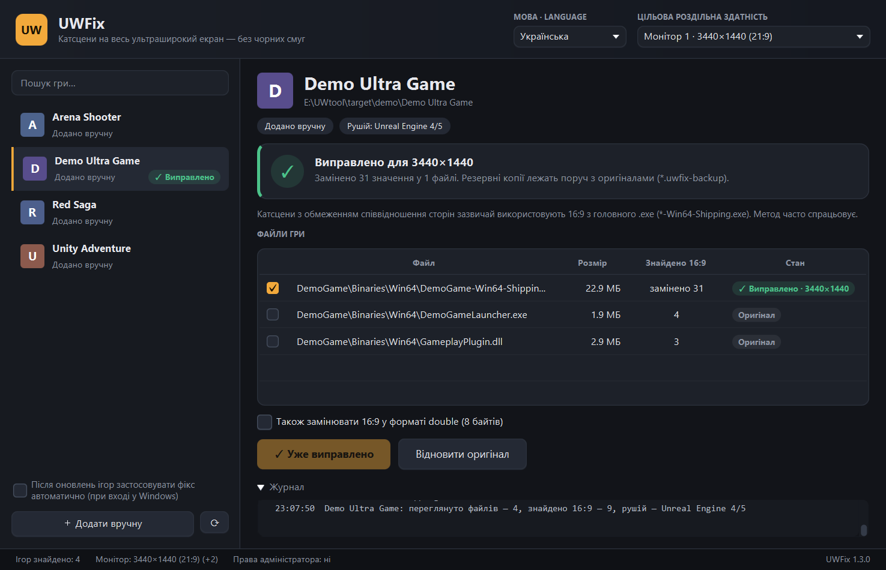
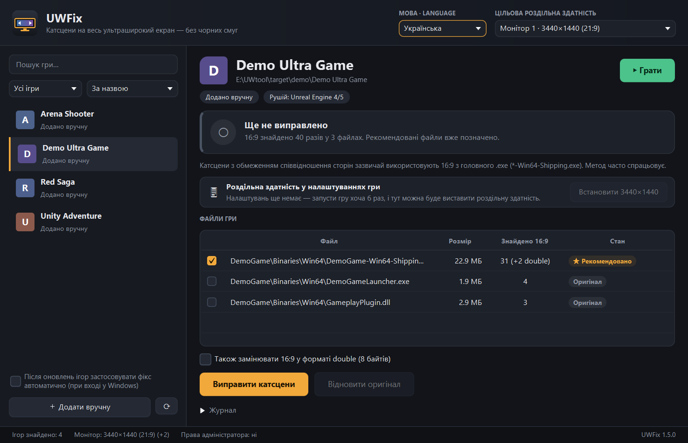
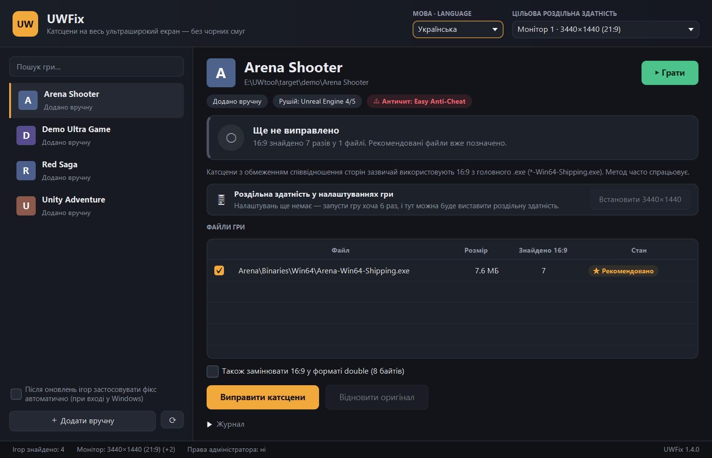
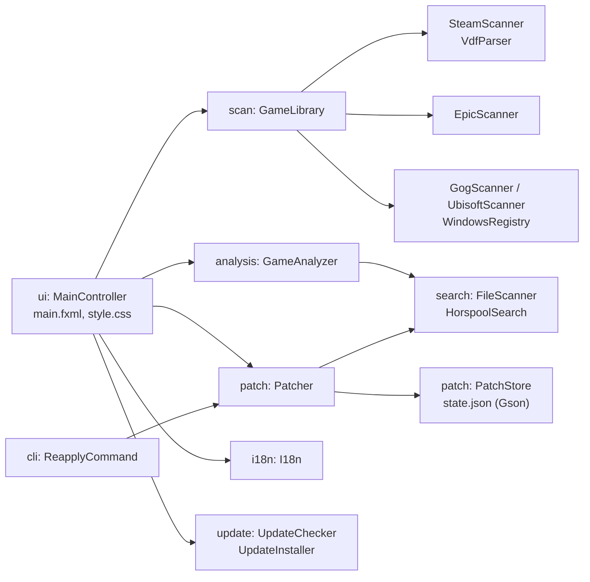

# UWFix — катсцени без чорних смуг на ультрашироких моніторах

[English](README.md) · **Українська**

UWFix знаходить встановлені ігри (Steam, Epic Games, GOG, Ubisoft Connect) і однією кнопкою
прибирає чорні смуги по боках у катсценах на моніторах 21:9 і 32:9. Працює у Windows і Linux (Proton, Wine).



**[⬇ Завантажити останню версію](https://github.com/shkbb/UWFix/releases/latest)** — інсталятор або портативна версія. Java вбудована, нічого встановлювати не треба. Windows 10/11 x64 і [Linux x64](#linux).

## Як це працює

Більшість ігор зберігає співвідношення сторін катсцен як дробове число 16 / 9 = 1.7777778.
У виконуваному файлі воно записане у форматі IEEE 754 (float, 4 байти, little-endian):

| Роздільна здатність | Співвідношення | Байти у файлі   |
|---------------------|----------------|-----------------|
| 1920×1080 (16:9)    | 1.778          | `39 8E E3 3F`   |
| 2560×1080 (21:9)    | 2.370          | `26 B4 17 40`   |
| 3440×1440 (21:9)    | 2.389          | `8E E3 18 40`   |
| 3840×1600 (24:10)   | 2.400          | `9A 99 19 40`   |
| 5120×1440 (32:9)    | 3.556          | `39 8E 63 40`   |

Якщо замінити `39 8E E3 3F` на значення свого монітора, гра вважатиме, що катсцени зроблені
під твій екран, і перестане додавати смуги. Так спільнота вручну виправляє ігри в hex-редакторі
(наприклад, [UltraAspect](https://github.com/coralian/UltraAspect) для The Witcher 3).
UWFix робить це автоматично й безпечно. **Підходить будь-яка роздільна здатність**: значення
обчислюється як ширина ÷ висота, а не береться з готової таблиці.

## Можливості

- **Пошук ігор**: Steam (усі бібліотеки на всіх дисках), Epic Games, GOG, Ubisoft Connect, а також ручне додавання будь-якої папки. У Linux — Steam (зокрема Flatpak і Snap) та Heroic Games Launcher.
- **Іконки та обкладинки ігор**: для Steam-ігор — іконка, фонове зображення й логотип з локального кешу Steam, для інших — іконка прямо з .exe гри (програма сама розбирає таблицю ресурсів формату Windows PE).
- **Пошук, фільтри й сортування**: пошук не чутливий до регістру й розділових знаків; показ усіх / виправлених / не виправлених / оновлених ігор; сортування за назвою (за українською абеткою), лаунчером або спершу виправлені.
- **Визначення моніторів**: усі підключені монітори визначаються автоматично з урахуванням масштабування Windows; можна обрати іншу роздільну здатність або ввести свою.
- **Аналіз гри**: знаходить .exe і .dll з числом 16:9, відкидає сторонні бібліотеки (Steam API, DirectX, PhysX…), визначає рушій (15 рушіїв — див. таблицю нижче) і радить, які файли змінювати.
- **Безпечна заміна**:
  - перед зміною створюється резервна копія `*.uwfix-backup`;
  - змінюються лише знайдені 4 (або 8) байтів, решта файлу не переписується;
  - перед кожним записом перевіряється, що на місці саме очікувані байти;
  - контрольна сума SHA-256 оригіналу й результату зберігається в стані програми.
- **Розблокування роздільної здатності**: для ігор, які не пропонують 3440×1440 у меню, UWFix записує її прямо в налаштування гри — `GameUserSettings.ini` (Unreal Engine 4/5), `*Engine.ini` (Unreal Engine 3, наприклад Life is Strange), реєстр (Unity), `video.txt` (Source) або `*Prefs.ini` (Skyrim, Fallout).
- **Кнопка «Грати»**: запускає гру через Steam / Epic / Ubisoft Connect (досягнення й хмарні збереження працюють) або напряму через .exe.
- **Відновлення оригіналу** однією кнопкою — навіть без резервної копії, бо програма знає всі змінені місця.
- **Відстеження оновлень**: після оновлення гри (Steam замінює файл) програма помічає, що фікс злетів, і пропонує застосувати його знову. Можна ввімкнути автоматичне повторне застосування при вході в систему (Windows або Linux).
- **Попередження про античит** (Easy Anti-Cheat, BattlEye, VAC тощо): змінювати файли онлайн-ігор небезпечно для акаунта.
- **Мови**: українська та англійська, перемикаються без перезапуску.
- **Автооновлення**: при запуску UWFix перевіряє на GitHub, чи вийшла нова версія; одна кнопка завантажує її, звіряє контрольну суму SHA-256 і перезапускає програму вже оновленою — завантажувати вручну більше не треба.

## Підтримувані рушії

| Рушій | Приклади | Як розпізнається | Роздільна здатність у налаштуваннях |
|-------|----------|------------------|-------------------------------------|
| Unreal Engine 4/5 | Silent Hill 2, Stellar Blade, Palworld | `*-Win64-Shipping.exe`, `Content\Paks` | `GameUserSettings.ini` |
| Unreal Engine 3 | Life is Strange, BioShock Infinite | `CookedPC*` | `*Engine.ini` → `[SystemSettings]` |
| Unity | Valheim, Content Warning | `UnityPlayer.dll` | реєстр (PlayerPrefs) |
| Source | Half-Life 2, Portal 2, Left 4 Dead 2 | `bin\engine.dll` | `cfg\video.txt` або реєстр |
| Creation Engine / Gamebryo | Skyrim, Fallout 3/4/New Vegas | `Data\*.esm` | `*Prefs.ini` → `iSize W/H` |
| REDengine | The Witcher 3, Cyberpunk 2077 | `bin\x64` + `content` | — |
| RE Engine | Resident Evil 2/3/4/7/Village, Monster Hunter | `re_chunk_000.pak` | — (порада: REFramework) |
| MT Framework | Resident Evil 5/6, Revelations | `nativePC*` | — |
| Source 2 | Counter-Strike 2, Dota 2 | `game\bin\win64\engine2.dll` | — (21:9 є в грі, VAC) |
| RAGE | GTA V, Red Dead Redemption 2 | `*.rpf` | — (21:9 є в грі) |
| CryEngine, Frostbite, GameMaker, Godot | | `CrySystem.dll`, `initfs_Win32`, `data.win`, `*.pck` | — |

Для кожного рушія UWFix показує чесну пораду: де заміна 16:9 допомагає, де гра сама підтримує 21:9, а де файли краще не чіпати (онлайн-ігри з античитом).

## Обмеження

- Метод працює, лише якщо гра зберігає 16:9 як готове число. Якщо співвідношення обчислюється інакше, UWFix покаже «Число 16:9 не знайдено».
- **Відеоролики, записані заздалегідь у 16:9, виправити неможливо**: у самому відео немає зображення по боках.
- Після заміни в окремих іграх інтерфейс може розтягнутися. Тоді натисни «Відновити оригінал».
- Налаштування гри з'являються після першого запуску — запусти гру хоча б раз, перш ніж виставляти роздільну здатність у UWFix.
- Ігри з Microsoft Store / Xbox Game Pass захищені від змін.
- Не використовуй програму для онлайн-ігор з античитом.

## Використання

1. Запусти `UWFix.exe` (портативна версія) або встанови програму інсталятором.
2. Перевір угорі цільову роздільну здатність (за замовчуванням — твій монітор).
3. Обери гру зліва й дочекайся аналізу файлів.
4. Натисни **«Виправити катсцени»**.
5. Якщо гра встановлена в `Program Files`, програма запропонує перезапуститися з правами адміністратора.

Дані програми: `%APPDATA%\UWFix\state.json` (стан і налаштування), `%APPDATA%\UWFix\reapply.log` (журнал автоперевірок).

## Linux

UWFix працює і в Linux — з Windows-іграми, що запускаються через Proton (Steam) або Wine (Heroic Games Launcher):

- **Встановлення**: розпакуй `UWFix-<версія>-linux-x64.tar.gz` і запусти `UWFix/bin/UWFix` або встанови пакет у Debian/Ubuntu: `sudo apt install ./uwfix_*_amd64.deb`.
- **Ігри**: Steam (звичайний, Flatpak і Snap), Epic Games і GOG, встановлені через Heroic (зі списків `installed.json`).
- **Заміна 16:9** працює так само, як у Windows: під Proton гра — той самий Windows .exe.
- **Розблокування роздільної здатності** шукає налаштування всередині префікса Wine гри: Steam створює його для кожної гри в `steamapps/compatdata/<AppID>/pfx`, Heroic зберігає шлях у налаштуваннях гри. Файли `.ini` лежать у `drive_c/users/steamuser/…`, а реєстр — це текстовий файл `user.reg`, який UWFix змінює напряму. Спершу закрий гру: Wine перезаписує цей файл під час виходу.
- **«Грати»** запускає ігри Steam через `steam://`; ігри Heroic — з самого Heroic.
- **Автозапуск**: `~/.config/autostart/uwfix-reapply.desktop`; дані програми: `~/.config/uwfix/`.
- **Автооновлення** працює для версії з tar.gz у папці, куди є право запису; для версії з .deb відкривається сторінка релізу.
- Нативні Linux-версії ігор (без Proton) не підтримуються: пошук 16:9 працює з Windows-файлами .exe/.dll.

<details>
<summary>Більше знімків екрана</summary>

| Аналіз гри | Попередження про античит |
|---|---|
|  |  |

</details>

## Збирання з вихідного коду

Потрібна лише JDK 17 або новіша. Maven завантажиться автоматично (Maven Wrapper).

```bash
mvnw javafx:run
```

```bash
mvnw test
```

```bash
powershell -ExecutionPolicy Bypass -File build-installer.ps1
```

```bash
./build-linux.sh --deb
```

| Команда | Що робить |
|---------|-----------|
| `mvnw javafx:run` | запуск під час розробки |
| `mvnw test` | модульні тести (JUnit 5) |
| `mvnw test -Pbenchmark` | порівняння швидкості алгоритмів пошуку; результат у `target\benchmark-results.txt`; `-Dbench.file=шлях\до\гри.exe` — на справжньому файлі |
| `build-installer.ps1` | портативна версія `dist\UWFix\UWFix.exe`, архів `.zip` та інсталятор `dist\UWFix-<версія>.exe` (потрібен [WiX Toolset 3](https://github.com/wixtoolset/wix3/releases) у `tools\wix`) |
| `build-linux.sh` | Linux: `dist/UWFix/bin/UWFix`, архів `UWFix-<версія>-linux-x64.tar.gz` і з `--deb` — пакет .deb |
| `make-screenshots.ps1` | знімки екрана для документації на демо-іграх (справжні ігри не змінюються) |

GitHub Actions на кожен коміт запускає тести в Ubuntu і Windows та додає до кожного релізу збірку для Linux.

## Структура проєкту

```
src/main/java/ua/uwfix/
├── Main.java, App.java       точка входу і запуск JavaFX
├── model/                    AspectRatio, ValueFormat (IEEE 754), Game, GameSource
├── search/                   алгоритми пошуку: NaiveSearch, KmpSearch, HorspoolSearch;
│                             FileScanner — потокове сканування файлу блоками + SHA-256
├── scan/                     пошук ігор: SteamScanner (парсер VDF), EpicScanner (JSON),
│                             GogScanner, UbisoftScanner (реєстр через reg export),
│                             HeroicScanner (Linux), GameLibrary
├── analysis/                 GameAnalyzer (вибір файлів), EngineDetector, AntiCheatDetector
├── settings/                 ResolutionUnlocker, IniEditor, UnityPrefs — роздільна здатність у налаштуваннях гри;
│                             WinePrefix, WineRegistry (user.reg) — те саме всередині Proton/Wine
├── icon/                     PeIconExtractor (іконки з .exe: ресурси PE, PNG/BMP), GameIconLocator (кеш Steam)
├── patch/                    Patcher (заміна, відновлення, повторне застосування), PatchStore (стан у JSON)
├── cli/                      ReapplyCommand — тихий режим --reapply
├── i18n/                     I18n, Language — переклад (messages_en/uk.properties)
├── update/                   UpdateChecker (GitHub Releases API), UpdateInstaller (завантаження, SHA-256, заміна),
│                             TarArchive (.tar.gz для Linux)
├── system/                   Os, SystemShell (відмінності Windows і Linux), монітори, права адміністратора, автозапуск
└── ui/                       MainController + main.fxml + style.css (MVC), діалоги, комірки
```

### Архітектура



- **Модель** — `model`, `search`, `scan`, `analysis`, `patch`: не залежать від інтерфейсу, покриті тестами.
- **Представлення** — `main.fxml` і `style.css`; тексти — у словниках `i18n/messages_*.properties`.
- **Контролер** — `MainController`: обробляє дії користувача, запускає довгі операції у фоновому потоці (`javafx.concurrent.Task`), щоб вікно не зависало.

## Тестування

200 модульних тестів (JUnit 5), що виконуються у Windows і Linux: перетворення співвідношень у байти, три алгоритми пошуку (порівняння з еталоном на випадкових даних), потокове сканування з різними розмірами блоку, парсери VDF / .reg / JSON, вибір файлів для різних рушіїв, повний цикл «патч → оновлення гри → повторне застосування → відновлення», пошкоджений файл стану, повнота перекладу (однакові ключі й параметри в обох мовах), порівняння версій і безпечне розпакування оновлень (зокрема архівів зі шляхами за межі папки), видобування іконок із синтетичного PE-файлу (PNG і BMP з маскою прозорості), пошук ігор у Linux (папки Steam, Heroic), читання і зміна реєстру Wine `user.reg`, пошук префікса Proton гри, розпакування .tar.gz.

Порівняння алгоритмів на 128 МБ даних, схожих на машинний код (`mvnw test -Pbenchmark`):

| Алгоритм | Шаблон 4 байти | 8 байтів | 16 байтів |
|----------|---------------:|---------:|----------:|
| Прямий перебір | 1786 МБ/с | 1905 МБ/с | 736 МБ/с |
| Кнута–Морріса–Пратта | 1443 МБ/с | 1439 МБ/с | 1455 МБ/с |
| Бойєра–Мура–Хорспула | 1546 МБ/с | 2868 МБ/с | 4628 МБ/с |

Для короткого шаблону 16:9 (4 байти) усі алгоритми впираються у швидкість пам'яті. Із довшим шаблоном
алгоритм Хорспула пропускає більшу частину даних і стає найшвидшим. Тому програма використовує саме його.

## Технології

Java 17 · JavaFX 21 (FXML + CSS) · Gson · JUnit 5 · Maven · jpackage/jlink · WiX Toolset 3 · GitHub Actions

## Ліцензія

[MIT](LICENSE). Програма надається «як є»: файли ігор ти змінюєш на власний ризик.
